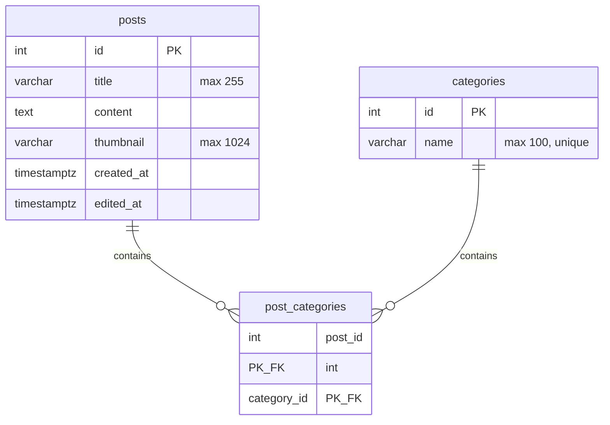

# データベース ER 図

SQLAlchemy の定義は [backend/app/models.py](../backend/app/models.py) にあります。投稿（`posts`）とカテゴリ（`categories`）は **多対多** で、中間テーブル `post_categories` で関連付けます。

## ER 図（Mermaid）

## リレーションの意味

| 関係 | 説明 |
| --- | --- |
| `posts` ↔ `post_categories` | 1 投稿は複数行の中間テーブル行を持ち得る（複数カテゴリ） |
| `categories` ↔ `post_categories` | 1 カテゴリは複数行の中間テーブル行を持ち得る（複数投稿） |
| 外部キー | `post_categories.post_id` → `posts.id`（`ON DELETE CASCADE`） |
| 外部キー | `post_categories.category_id` → `categories.id`（`ON DELETE CASCADE`） |

## 補足

- スキーマのマイグレーションは Alembic（`backend/alembic/`）で管理されています。
- 上記はアプリの ORM モデルに基づく論理モデルです。実際の型名は PostgreSQL の定義に従います。
