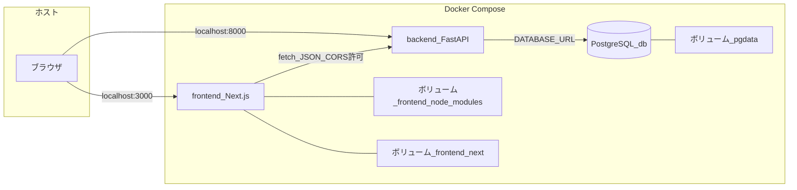
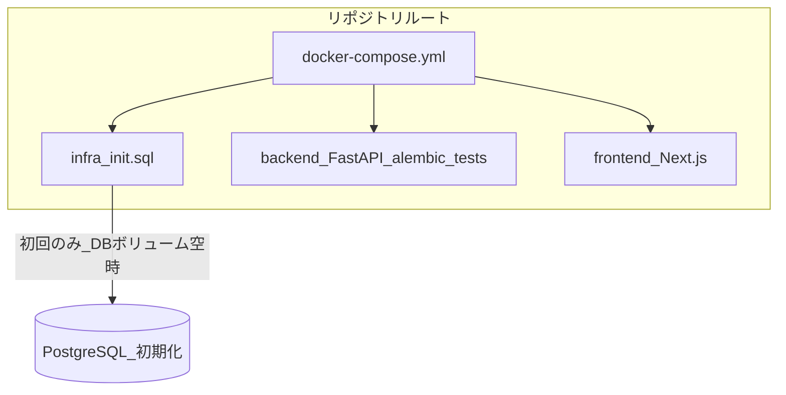

# リポジトリ構成の概要

このドキュメントは、`docker_postgres_fastapi` モノレポ内の **Docker サービス**・**通信**・**主なディレクトリ**の関係を図で示します。

## Docker Compose 上のサービスとデータの流れ

ブラウザは **ホスト** 上のポート経由でフロントと API にアクセスします。フロントからの API 呼び出しは、ブラウザが `NEXT_PUBLIC_API_URL`（既定 [`http://localhost:8000`](http://localhost:8000)）へ直接リクエストする形です（フロントコンテナ経由ではない）。

## ディレクトリと責務

アプリ本体・インフラ初期化・Docker 定義の対応関係です。

## 補足

| 項目 | 内容 |
| --- | --- |
| バックエンド | `backend/` … FastAPI ルーティングは `backend/app/routers/` に分割 |
| フロント | `frontend/` … `app/posts`・`app/posts/add` など App Router |
| 参照 | 運用手順はリポジトリルートの [README.md](../README.md) を参照 |
| DB テーブル | [database-er.md](database-er.md)（ER 図） |
